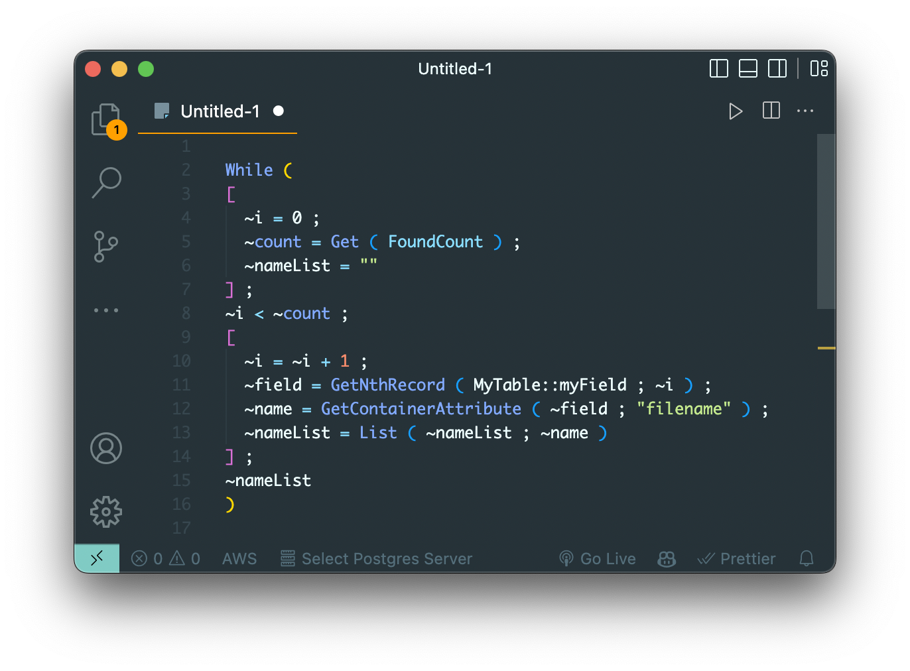
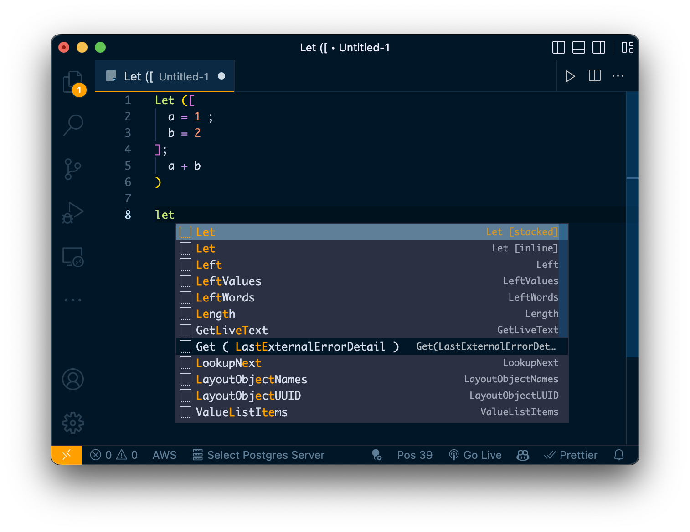
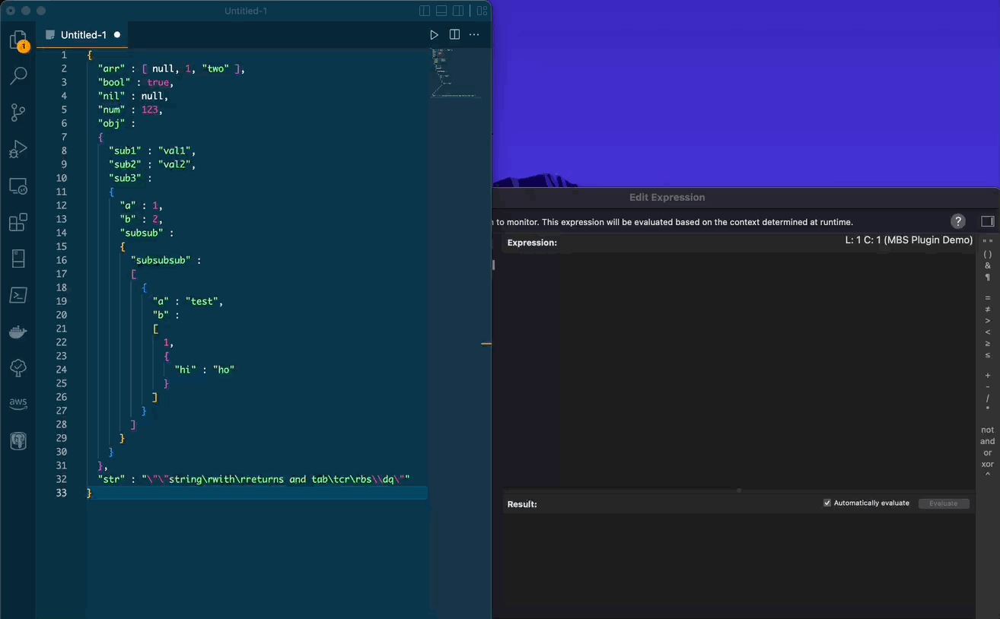

# FileMaker VSCode

Filemaker syntax and snippets for Visual Studio Code.
<https://github.com/jwillinghalpern/filemaker-vscode-bundle>

## Features

Snippets, autocompletion, and syntax highlighting for FileMaker calculations.

## Installation

The best way to install is via the VSCode extension marketplace. Search `Filemaker VSCode` in the extensions tab within VSCode and click "install".

[Or install from the marketplace site here](https://marketplace.visualstudio.com/items?itemName=jwillinghalpern.filemaker-vscode)

## Usage

### Syntax Highlighting

### Autocomplete / Snippets

### JSON to JSONSetElement() expression

## Attribution

Original syntax and snippets were ported from [Donovan Chandler's textmate bundle](https://github.com/DonovanChan/Filemaker.tmbundle), which was itself forked from [Matt Petrowsky's repo](https://github.com/petrowsky/filemaker.tmbundle).

[Carson Lind](https://eagleoptimizations.com/) created the icon artwork.

---

## Contributing

### Prerequisites

1. Make sure you have NodeJS and npm installed: <https://nodejs.org/en/>
2. Install vsce globally: `npm install -g vsce`
3. Make sure git is installed: <https://git-scm.com/book/en/v2/Getting-Started-Installing-Git>
   1. MacOS hint: just run this in terminal and you'll be prompted to install: `git --version`

### Dev/Test

1. Fork the GitHub repo.
2. Clone your fork to your local machine:
   1. In terminal, `cd` to the preferred directory.
   2. Clone: `git clone <the URL from the "Code" button on github>`
3. Open the project folder in VSCode to edit.
4. When ready to test:
   1. Open the integrated terminal in VSCode and run `vsce package` to create a package with a name like "filemaker-vscode-x.x.x.vsix"
   2. Install your test package like `code --install-extension filemaker-vscode-x.x.x.vsix`
   3. shift-command-p to open the command pallete and search for/run "Developer: Reload Window(s)"
   4. Now test your extension in VSCode. Rinse, repeat until it works how you want.

### Submit changes

1. When ready, commit your changes and push them to your own fork on github.
   1. `git add .`
   2. `git commit -m "message describing your change"`
   3. `git push`
2. Submit a pull request to my repo so I can try them out and pull them in and publish!
